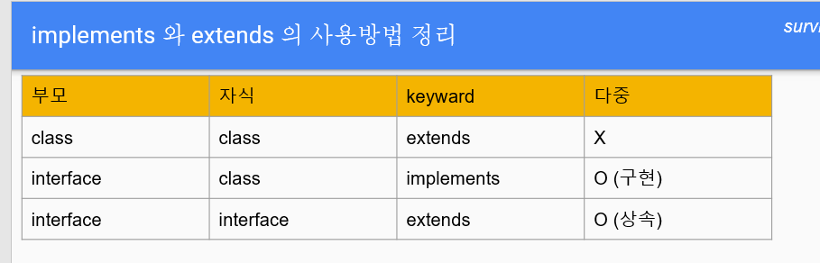

# 2026-06-16

## 오늘 배운 내용

[추상클래스] ❤️abstract class (부모클래스)-> class Book extends TangibleAsset(자식클래스)
ㄴ> 📌추상클래스의 코드 형태:
ㄴ> public abstract void operate(); ❤️추상적일때 void가 있을때 ()이렇게 정의
ㄴㄴㄴㄴㄴㄴㄴㄴㄴㄴㄴㄴㄴㄴㄴㄴㄴㄴ> 위에는 반환이 없는 매서드 || 있을때는 변수명+(int, double, boolean, String)
ㄴㄴㄴㄴㄴㄴㄴㄴㄴㄴㄴㄴㄴㄴㄴㄴㄴㄴ> return은 자식에게서 하도록
ㄴ> 이름만 만 만든 클래스 (자식 클래스에서 자세한 구현) // extends가 자식 클래스
ㄴ> {} 구현부가 없는 매서드
ㄴ> 인스턴스화 금지

[인터페이스]
ㄴ>📌인터페이스의 코드 형태:
implements 실제 규칙을 구현(개발자가 작성해야될 부분🥲🥲)
class Duck implements Flyable, Swimable {
@Override //Override는 컴파일 전 메서드 이름 일치 여부 확인, 실수 방지 || assertEquals는 실행 중 값과 결과를 검사
public void fly() {
System.out.println("날기");
}

@Override
public void swim() {
System.out.println("수영");
}
}
ㄴ> 필드 가지지 않음
ㄴ> 상수 선언
ㄴ> 여러 인터페이스를 구현 (여러 규칙서를 동시에 구현)



## 기억해야 할 내용

## 기억 되짚기

생성자
캡슐화 private 데이터 자물쇠 -> getter/setter로 안전하게 데이터를 열기
generate > Construct > setter/getter 이거 꼭 집어 넣어라!!!!!!!!!!!!!!!!!!!
복제하기위해 생성자 & superclass를 만든다.
[ 생성자 오버로드 Overload ] :: 하나의 생성자 + 타입이 다른 여러 방법의 정의 형태
Hero() {}
Hero(String name) {}
Hero(String name, int hp) {}.

[ 부모에 덮어쓰기 오버라이드 Override ] ::

- 부모의 원본 기능을 호출
- 부모의 원본 코드를 재활용하면서 기능을 추가하여 캐릭터 등이 업그레이드
  [ getter / setter 주로 쓰는 경우 ] ::

- private 변수 접근할 때
- 값 검증 시
- final 상수는 getter만 사용

[ 단축키 ] ::

- Ctrl+Alt :: 함수가 작성된 실제 위치로 이동
- Ctrl+B :: 함수 상속 위치 이동
- shift + F6 :: 이미 정해진 클래스 함수의 이름을 전체 변경하려 할때

## 실습 코드

```java
public class Cleric {


}
